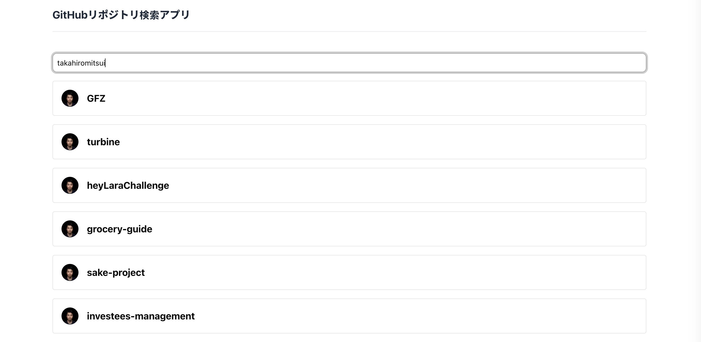
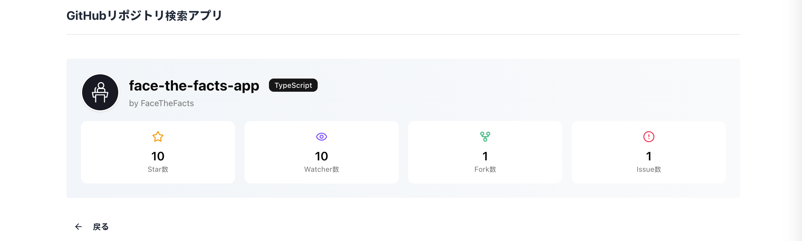
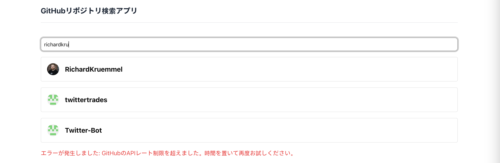

## ワンディー株式会社 コーディングチャレンジ（GitHubリポジトリ検索アプリ）

Next.js 15 を使用して、GitHub のリポジトリを検索し、その情報を一覧表示するアプリケーションを作成しました。
## 前提条件
このアプリケーションは Docker に対応しているため、Docker 経由で実行する場合は以下が必要です：

- Docker
- Docker Compose

また、ローカル環境で直接実行する場合は、以下の環境を整えてください：
- Node.js 18 以上
- パッケージマネージャー（pnpm、npm など）
- next のバージョンは 15.2.5 を使用しているため、Next.js 15 以上が必要です。
## ローカルでの実行方法/テストの実行方法

### ✅ Docker を使う場合
アプリの起動：
```bash
docker compose up app
```
ブラウザでアクセス：
```bash
http://localhost:3000
```
終了：
```bash
docker compose down
```
テストの実行：
```bash
docker compose up test
```
### ✅ Docker を使わない場合
アプリの起動：
```bash
pnpm dev
# または
npm run dev
```
ブラウザでアクセス：
```bash
http://localhost:3000
```
テストの実行：
```bash
pnpm test
# または
npm run test
```
## 工夫した点・こだわったポイント
### モダンなUIを意識した検索体験
ユーザーの操作性を高めるため、「検索」ボタンを排除し、debounce を使って入力後に自動で検索される仕組みを導入しました。
### 無限スクロールの実装
`TanStack Query` を用いて無限スクロールを実装。初期段階では「もっと見る」ボタンを使用していましたが、ユーザビリティを考慮し、`react-intersection-observer` を導入してスクロールに応じて自動で次のページをロードするようにしました。
### データの再利用・パフォーマンスの最適化
検索結果のレポジトリデータをキャッシュし、詳細ページでも再フェッチせずにそのまま表示することで、API呼び出しを最小限に抑えました。
### Rate Limit 対策としてのUX配慮
今回は個人の GitHub トークンを使用せず、Rate Limit による制限が発生するケースを想定しました。その際、GitHub API のエラーメッセージを日本語に変換して表示することで、ユーザーが状況を理解しやすくなるよう配慮しました。
### スタイリングの統一
マージンやパディングのバラつきを防ぐために共通の `MaxWidthWrapper` コンポーネントを作成し、レスポンシブ対応も考慮した UI を構築しました。
### コミットメッセージの明確化
`Conventional Commits` に従い、`chore`, `feat`, `test`, `refactor`, `docs` などを適切に使い分け、自身の実装意図や変更内容を明確に伝えるよう心がけました。
 
## Screenshots
### 検索ページ

### 詳細ページ

### エラー画面
